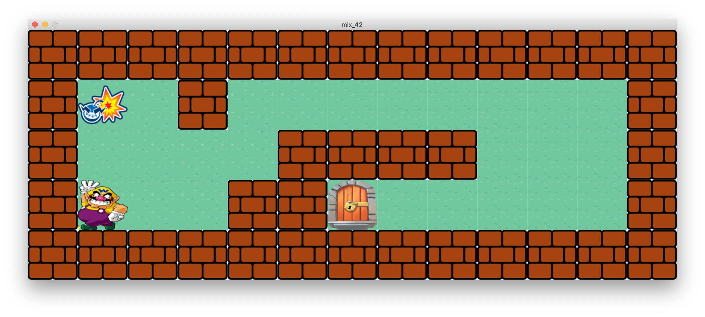
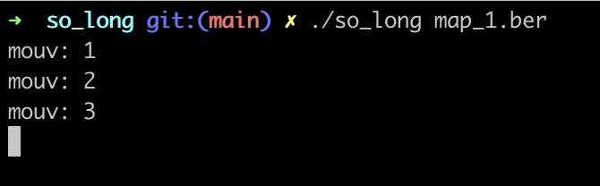
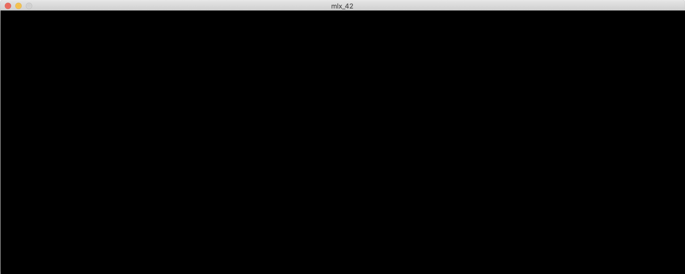

-----
* **So_long** is the first graphic project of the 42 course.
* The notions acquired are **windows managing**, **event managing**, **choice** of **colors and texture**.
* the school's graphic library: **the MiniLibX** is required for this project.

## The game

&nbsp;&nbsp;

* The player's goal is to **collect all the items** on the map, **then escape**.
* The `W`, `A`, `S` and `D` keys must be used to move the main character.
* The player must **not** be able to **move** **within the walls**.
* For **each movement**, the **total number** of transactions should be **displayed in the
  shell**.

&nbsp;&nbsp;&nbsp;&nbsp;&nbsp;&nbsp;

## Graphic management

* Your program must display an image in a window.

&nbsp;&nbsp;&nbsp;&nbsp;&nbsp;&nbsp;

* Press the `ESC` key to **close the window** and **exit the program cleanly**.
* Clicking on the `cross` at the top of the window will **close the window and exit the program properly**.

## The Map

* The **map** will be constructed using 3 elements: the **walls**, the **items to collect**, and the **empty space**.

&nbsp;&nbsp;&nbsp;&nbsp;&nbsp;&nbsp;

* Your card can be composed of these 5 characters:
  * `0` for an empty slot, (grass).
  * `1` for a wall, (mario walls)
  * `C` for a collectable item (C for collectible), (wario_bomb).
  * `E` for exit, (door)
  * `P` for the starting position of the character, (wario).

&nbsp;&nbsp;&nbsp;&nbsp;&nbsp;&nbsp;

* The Map must contain **1 exit**, at least **1 item** and **1 starting position**.
* the card must be in `.ber`, valid basic `.ber` card:

  *     11111
        1C001
        1P0E1
        11111

  *     1111111111111
        1C010000000C1
        1000011111001
        1P0011E000001
        1111111111111

  *     111111111111111111111111
        1E0000000000000C00000001
        101001010010000010100101
        101001001010101000100101
        1P0000000C00C000000001C1
        111111111111111111111111

* To compile the `mlx`.
  *      $(CC) -Wall -Wextra -Werror -Imlx -c $< -o $@

* To initialize `MiniLibX` one could do the following.

  *     void	*mlx;
        mlx = mlx_init();

* **Initializing** a tiny **window** which will stay **open forever**.

  *     mlx_win = mlx_new_window(mlx, 1920, 1080, "Hello world!");

  * initiate the window rendering :
  *     mlx_loop(mlx);

* **Read** from a **file to** an **image object**.

  *     void	*img;
        char	*relative_path = "./test.xpm";
        int	img_width;
        int	img_height;

  *     img = mlx_xpm_file_to_image(mlx, relative_path, &img_width, &img_height);

* Puts an **image** to the given **window instance at location** (x,y).
  *     mlx_put_image_to_window(mlx, mlx_win, img.img, 0, 0);

* **Destroys a window** instance accordingly.
  *     mlx_destroy_window(mlx->mlx, mlx->mlx_win);
  
## Source

* [42 Docs](https://harm-smits.github.io/42docs/)
* [subject](https://cdn.intra.42.fr/pdf/pdf/68556/fr.subject.pdf)
