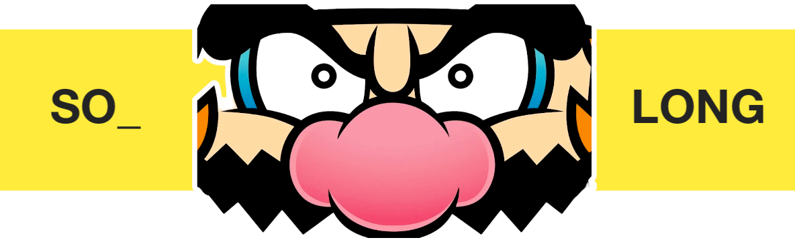

<<<<<<< HEAD

# so_long[]

=======
## So_long 

* **So_long** is the first game project from 42Lausanne.
* The notions acquired are **windows managing**, **event managing**, **choice** of **colors and texture**.
* The **mlx_library** is required for this project.
>>>>>>> df8318357b432ee9154338e3b4c11ac8254e9bb0
