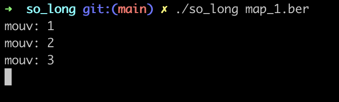

-----
* **So_long** is the first graphic project of the 42 course.
* The notions acquired are **windows managing**, **event managing**, **choice** of **colors and texture**.
* the school's graphic library: **the MiniLibX** is required for this project.

## The game

&nbsp;&nbsp;

* The player's goal is to **collect all the items** on the map, **then escape**.
* The `W`, `A`, `S` and `D` keys must be used to move the main character.
* The player must **not** be able to **move** **within the walls**.
* For **each movement**, the **total number** of transactions should be **displayed in the
  shell**.

&nbsp;&nbsp;&nbsp;&nbsp;&nbsp;&nbsp;
