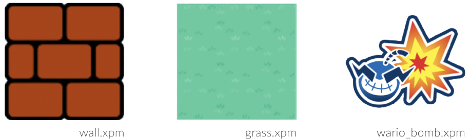

-----
* **So_long** is the first graphic project of the 42 course.
* The notions acquired are **windows managing**, **event managing**, **choice** of **colors and texture**.
* the school's graphic library: **the MiniLibX** is required for this project.

## The game

&nbsp;&nbsp;

* The player's goal is to **collect all the items** on the map, **then escape**.
* The `W`, `A`, `S` and `D` keys must be used to move the main character.
* The player must **not** be able to **move** **within the walls**.
* For **each movement**, the **total number** of transactions should be **displayed in the
  shell**.

&nbsp;&nbsp;&nbsp;&nbsp;&nbsp;&nbsp;

## Graphic management

* Your program must display an image in a window.

&nbsp;&nbsp;&nbsp;&nbsp;&nbsp;&nbsp;

* Press the `ESC` key to **close the window** and **exit the program cleanly**.
* Clicking on the `cross` at the top of the window will **close the window and exit the program properly**.

## The Map

* The **map** will be constructed using 3 elements: the **walls**, the **items to collect**, and the **empty space**.

&nbsp;&nbsp;&nbsp;&nbsp;&nbsp;&nbsp;

* Your card can be composed of these 5 characters:
  * `0` for an empty slot, (grass).
  * `1` for a wall, (mario walls)
  * `C` for a collectable item (C for collectible), (wario_bomb).
  * `E` for exit, (door)
  * `P` for the starting position of the character, (wario).

&nbsp;&nbsp;&nbsp;&nbsp;&nbsp;&nbsp;

